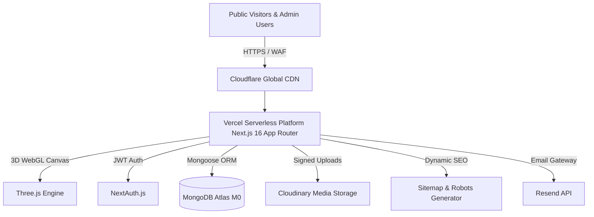

<div align="center">

# 🌙 MeeladFest

### *Multi-Tenant Madrasa Fest Management Platform*

[](https://meelad-fest-kerala.vercel.app/)
[](https://nextjs.org/)
[](https://threejs.org/)
[](https://www.typescriptlang.org/)
[](https://tailwindcss.com/)
[](LICENSE)

**A modern, serverless web platform empowering madrasas across Kerala to seamlessly organize, manage, and showcase annual Meelad Fest cultural & arts competitions.**

[Explore Live Demo](https://meelad-fest-kerala.vercel.app/) · [Read Documentation](docs/PRD.md) · [View Release Notes](CHANGELOG.md)

</div>

---

## 📖 Overview

**MeeladFest** is an enterprise-grade, multi-tenant competition management system specifically tailored for Madrasa Arts & Cultural Festivals (Meelad Fest). Built with **Next.js 16 (App Router)**, **Three.js (v1.5.0)**, **MongoDB Atlas**, and **Tailwind CSS v4**, it provides an elegant **Islamic Modern Design System** featuring 3D interactive WebGL elements, gold accents, deep emerald tones, custom Arabic typography (Amiri), and rich micro-interactions.

### 🎨 Visual Theme & Branding (v1.5.0 & v1.6.0)
- **3D WebGL Canvas**: Extruded 3D Gold Metallic Crescent Moon & 5-Pointed Star model with floating 3D gold stardust particles (`ThreeHeroCanvas.tsx`).
- **Performance Guard**: `IntersectionObserver` automatically pauses WebGL animation when offscreen to preserve GPU/battery, with graceful WebGL context fallbacks.
- **Colors**: Deep Emerald (`#0f3d26`), Warm Gold (`#c8962a`), Soft Cream (`#faf7f0`), Warm Border (`#e8e2d5`).
- **Typography**: `Amiri` for headlines and Arabic numbers (`١`, `٢`, `٣`), `Inter` for clean tabular data.
- **Components**: Geometric arabesque patterns, podium showcases, live status badges, and official watermark chips.

---

## 🌟 Key Capabilities

### ✨ Interactive 3D WebGL Hero Canvas (v1.5.0)
- **Custom Extruded 3D Geometries**: Handcrafted 3D gold crescent moon & star shapes with real-time lighting and ambient reflection.
- **Glowing Stardust Cloud**: 280+ animated 3D particle dust floating in 3D space with depth-buffered opacity rendering.
- **Resource Management**: Auto-pauses WebGL animation loop when canvas scrolls offscreen or browser tab goes inactive.

### 🚀 SEO & Search Indexing Engine (v1.6.0)
- **Dynamic XML Sitemap (`/sitemap.xml`)**: Crawls MongoDB published festival records (`/fests/[slug]`) dynamically along with static public routes.
- **Crawler Instructions (`/robots.txt`)**: Allows search engine indexing for public pages while shielding administrative (`/dashboard/`) & API (`/api/`) endpoints.
- **Social Graph Metadata**: Full OpenGraph & Twitter `summary_large_image` cards configured with canonical `metadataBase` resolution.

### 🎪 Multi-Tenant Festival Engine
- **Instant Festival Onboarding**: Any Madrasa admin or ustad can register and launch a custom festival page with a dedicated URL slug (`/fests/your-fest-slug`).
- **Granular Sub-Admin RBAC**: Assign co-admins with section-specific privileges (`participants`, `results`, `updates`, `gallery`).
- **Audit Trails**: Built-in `activity_log` tracking all administrative actions with IP and timestamp metadata.
- **Soft-Delete Protection**: Safe data deletion safeguards ensure historical scores, teams, and logs are never permanently lost.

### 🏆 Live Leaderboards & Champion Podiums
- **Top 3 Winner Podiums**: Styled 1st (Gold 🥇), 2nd (Silver 🥈), and 3rd (Bronze 🥉) rank highlights for overall teams and individual champions.
- **Category Filtering & Search**: Filter instantly by age categories (*Sub-Junior, Junior, Senior, Super Senior*) or search by chest number and participant name.
- **Real-Time Point Aggregation**: Animated progress bars with 30-second background auto-polling for live festival updates.

### 📜 Self-Service QR & PDF Certificates
- **Instant Certificate Generation**: Powered by `@react-pdf/renderer` with embedded Malayalam typography (`Noto Sans Malayalam`).
- **Self-Service Verification**: Visitors enter their Chest Number or Fest ID on `/verify/[code]` to instantly generate and download official participation and winner certificates.

### 🖼️ Public Gallery, Live Updates & FAQ System
- **Cloudinary Integration**: Cloudinary signed uploads for high-resolution event media galleries.
- **Public Feed & Feedback**: Real-time announcement streams and public inquiry/feedback response management.

---

## 🏗️ System Architecture



---

## 🛠️ Technology Stack

| Layer | Technology | Details |
|---|---|---|
| **Framework** | Next.js 16 (App Router) | React Server Components, Server Actions & Route Handlers |
| **3D Graphics** | Three.js v1.5.0 | WebGL extruded shapes, particle clouds & offscreen pause observer |
| **SEO Suite** | Dynamic Sitemap & Metadata | MongoDB crawler indexing, `robots.txt` & OpenGraph/Twitter cards |
| **Language** | TypeScript 5 | Strict type checking & API contracts |
| **Styling** | Tailwind CSS v4 | Custom `@theme` tokens, HSL colors & Arabesque geometry |
| **Database** | MongoDB Atlas & Mongoose | Multi-tenant schema design with indexed queries |
| **Authentication**| NextAuth.js | Credentials Provider, JWT session strategy & bcrypt hashing |
| **Media Handling** | Cloudinary API | Signed uploads & auto-optimized image delivery |
| **Certificates** | `@react-pdf/renderer` | Client & server PDF rendering with Malayalam font support |
| **Deployment** | Vercel (Hobby Tier) | Serverless edge deployment with zero server maintenance |

---

## 🚀 Quick Start Guide

### Prerequisites
- **Node.js**: `v18.0.0` or higher
- **MongoDB Atlas**: Free M0 Cluster URI
- **Cloudinary Account**: Cloud Name, API Key & Secret
- **Resend API Key**: Free tier credentials

### 1. Installation
```bash
# Clone the repository
git clone https://github.com/muhammedadnank/MeeladFest.git

# Navigate into project directory
cd MeeladFest

# Install dependencies
npm install
```

### 2. Configure Environment Variables
Create a `.env.local` file in the root directory:
```env
# Database Connection
MONGODB_URI=mongodb+srv://<username>:<password>@cluster.mongodb.net/meeladfest?retryWrites=true&w=majority

# Authentication
NEXTAUTH_SECRET=your_super_secret_jwt_key
NEXTAUTH_URL=http://localhost:3000
NEXT_PUBLIC_APP_URL=http://localhost:3000

# Resend Email Gateway
RESEND_API_KEY=re_xxxxxxxxxxxxxxxxx

# Cloudinary Media Storage
CLOUDINARY_CLOUD_NAME=your_cloud_name
CLOUDINARY_API_KEY=your_api_key
CLOUDINARY_API_SECRET=your_api_secret
```

### 3. Run Development Server
```bash
npm run dev
```
Open [http://localhost:3000](http://localhost:3000) in your browser.

---

## 📁 Repository Structure

```
MeeladFest/
├── docs/                    # Architecture Specs & Guides
│   ├── PRD.md               # Product Requirements Document
│   ├── TRD.md               # Technical Requirements Document
│   ├── DB-Schema.md         # MongoDB Collection Schemas & Indexes
│   └── Implementation-Plan.md # Development Milestones
├── changelogs/              # Version Release Notes
│   ├── v1.5.0.md            # Three.js 3D WebGL Visuals Release Notes
│   └── v1.6.0.md            # SEO Suite & Sitemap Release Notes
├── src/
│   ├── app/                 # Next.js App Router (Pages & REST Endpoints)
│   │   ├── (auth)/          # Login & Registration Screens
│   │   ├── api/             # RESTful API Route Handlers
│   │   ├── dashboard/       # Administrative Control Center
│   │   ├── fests/[slug]/    # Public Festival Portal Pages
│   │   ├── robots.ts        # Dynamic Search Crawler Policy Engine
│   │   └── sitemap.ts       # Dynamic MongoDB XML Sitemap Generator
│   ├── components/          # Design System & UI Components
│   │   ├── fest/            # Podium, TabBar, LeaderboardRow, FestBanner
│   │   ├── home/            # HeroSection, StatsBar, FestCard, FeatureGrid
│   │   ├── layout/          # Navbar & Footer
│   │   └── ui/              # ThreeHeroCanvas, GeometricPattern, OfficialChip, LiveBadge
│   ├── lib/                 # Core Helpers (DB, Auth, Permissions, Audit Log)
│   ├── models/              # Mongoose Data Models
│   └── types/               # TypeScript Definitions
```

---

## 🌿 Contribution & Git Commit Guidelines

To maintain a clean, readable, and traceable repository history, all contributors and AI assistants must follow the **Atomic Commit Workflow**:

### 1. Atomic (File-by-File) Commits
- **Do NOT bulk commit** multiple component files or pages into a single commit.
- Stage and commit **one file (or one atomic component unit) at a time**.
- *Rationale*: Atomic commits ensure precise code reviews, effortless `git revert` / `git cherry-pick` actions, and transparent commit history per component.

### 2. Conventional Commit Messaging
Format all commit messages adhering to the Conventional Commits standard:
```bash
# Example atomic commit workflow:
git add src/components/home/QuickVerifySection.tsx
git commit -m "feat(home): add QuickVerifySection component for instant certificate lookup"

git add src/components/home/AboutPlatformSection.tsx
git commit -m "feat(home): add AboutPlatformSection component for platform mission & features"

git add src/app/page.tsx
git commit -m "feat(home): integrate QuickVerify, AboutPlatform, and FAQ sections into home page"
```

Common prefixes:
- `feat(scope)`: New features or UI components
- `fix(scope)`: Bug fixes & patches
- `docs(scope)`: Documentation, CHANGELOG, or README updates
- `refactor(scope)`: Code restructuring without functional changes
- `style(scope)`: UI styling or formatting tweaks

---

## 📜 License

Distributed under the **MIT License**. See `LICENSE` for more information.

<div align="center">
<br />
Crafted with ❤️ for Madrasa Cultural Festivals across Kerala.
</div>

